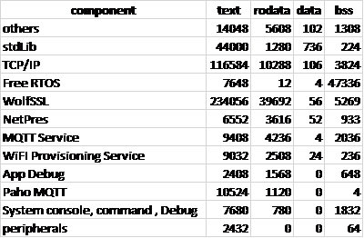

# Introduction

A tool to generate modular memory usage summry of MPLABX based PIC32 projects.

# Usage

- Make sure that compiler tools are added to system PATH (e.g. _C:\Program Files\Microchip\xc32\v2.40\bin_)
  - Make sure that you have python 3 installed in your system.
  - unzip/clone tool to anywhere in the system.
  - execute with: python mapfileParse.py <_path to project.x_>
- report will be geenrated in the build output folder (_project.x\dist\project\curiosity_)

# Results

Results will be generated in the build output folder (_project.x\dist\project\curiosity_). This includes :

|     |                           |                                                   |
| --- | ------------------------- | ------------------------------------------------- |
| 1   | <_project_>\_summary.csv  | Modular summary of memroy                         |
| 2   | <_project_>\_fileSize.csv | File wise memory usage                            |
| 3   | <_project_>\_syms.csv     | memory usage of symbols with associated files     |
| 4   | <_project_>\_clean.map    | map file with non-linked sections removed from it |

Summary will look like this:

